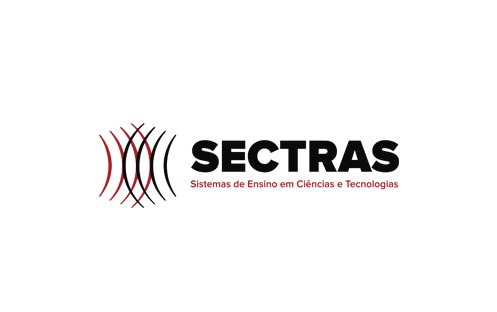

# 🎓 Publicações Acadêmicas – Carla Guimarães de Medeiros

  

  

## 📖 Sobre

Este repositório reúne artigos, capítulos de livro e apresentações de conferências de Carla Guimarães de Medeiros, pesquisadora na área de **Análise de Sistemas e Educação**. Cada pasta contém o PDF da publicação, além de metadados (autores, evento, DOI).

---

